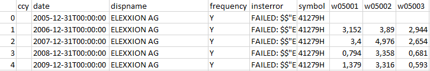

# PyDSout: DataStream requests made simple

**Author:** Marcus Bravidor ([marcus.bravidor@hhu.de](mailto:marcus.bravidor@hhu.de))
**Version:** PyDSout 0.1
**Date:** 2018-04-04
**License:** [MIT License](https://opensource.org/licenses/MIT) 

**Purpose:** Automatically request firm-level financial data (e.g., WorldScope) from Thomson Reuters DataStream and save the results to a long format CSV file (separator: semicolon or ";"). The resulting file will look this:



**Requirements:** Valid DataStream license and credentials (usually supplied by your company or institution).

**Acknowledgements:** This script is based on [PyDataStream by Vladimir Filimonov](https://github.com/vfilimonov/pydatastream).

## Contents

1. [Setup](#setup)
2. [Customize the request](#customizing-the-request)
3. [Resulting file](#resulting-file)
4. [Troubleshooting](#troubleshooting)

## Setup

Install the necessary packages via the pip installer:

```python
pip install pandas
pip install suds
pip install json
pip install pydatastream
```

Copy `PyDSout.ipynb`, `firms.txt`, and `items.txt` in the same folder. 

Start *Jupyter Notebook* and you're ready to go.

## Customizing the request

Use the following steps to start a customized request:

* **Time span:** Change the key variables to your desired values:

  * `enddate`: Date for last request in ISO format (YYYY-MM-DD)
  * `startdate`: Date for first request in ISO format (YYYY-MM-DD)
  * `freq`: Frequency of the request. Possible values: Yearly (Y), Monthly (M), Weekly (W), Daily (D)


* **Firms** to request: Add a file named `firms.txt` to the `root` directory. Format:

```
DSID1
DSID2
DSID3

756944
866922
278419
```

* **Items** to be requested per firm: Add a file named `items.txt` to the `root` directory. Format:

```
code1,code2,code3,
NOSHFF,WC05301,WC07101,
```
## Resulting file

The resulting file is a semicolon-separated (";") long-format CSV file called `ds_output.csv`.

## Troubleshooting

**Unexpected errors or connections breaks while requesting data**

1. Continue with the conversion to a structured list.
2. Since the last entry in `dobject` is incomplete, the export to CSV would result in an error. Therefore, change the line `for i in range(1,len(dobject)):`  to `for i in range(1,len(dobject)-1):`. 
3. Remove the IDs of firms with completed requests from `firms.txt`.

*Important note:* PyDSout automatically replaces existing export files. To save your export, you should either rename the name of automatically created CSV file or name of the next export file by editing line `df.to_csv('ds_output.csv', sep=';', encoding='utf-8')`. The numerous resulting files can be merged later one with your preferred statistical software or using the [pandas package](https://pandas.pydata.org/pandas-docs/stable/merging.html) in Python.